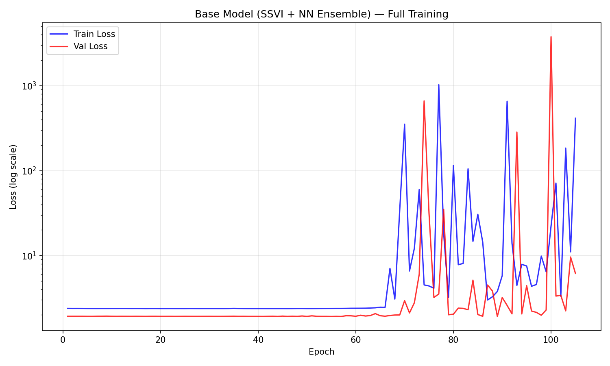
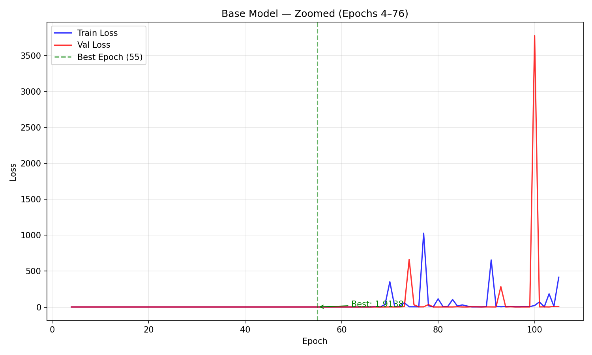
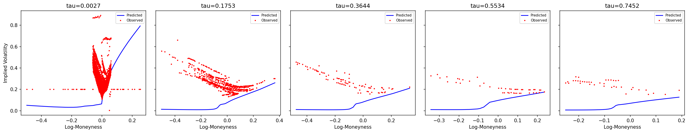
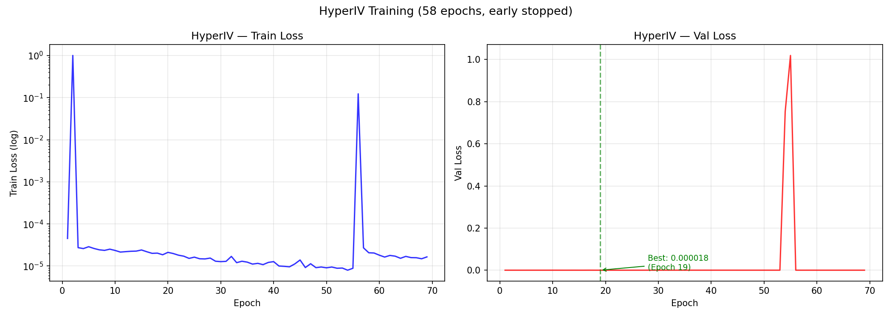
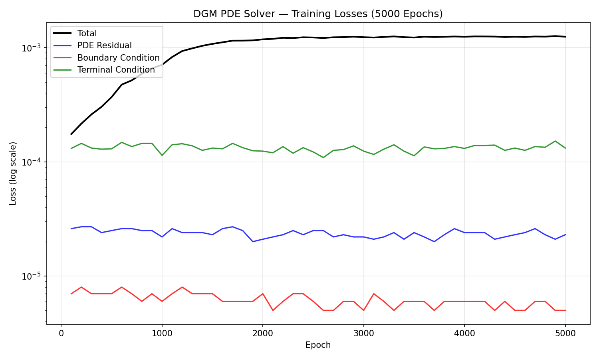
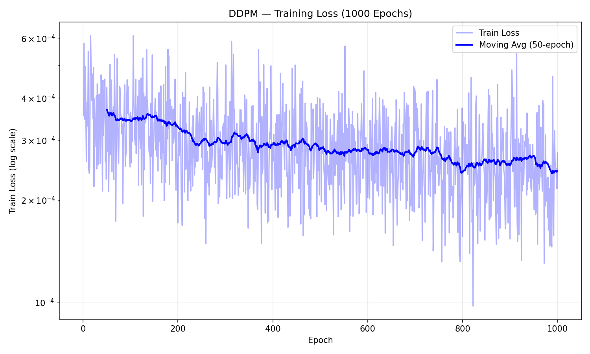
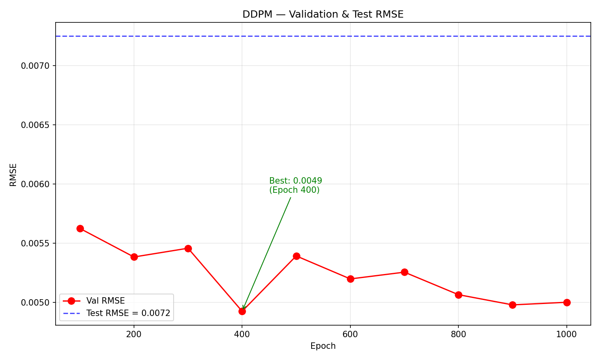
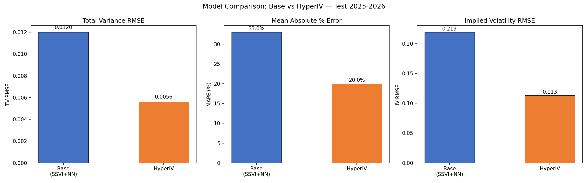
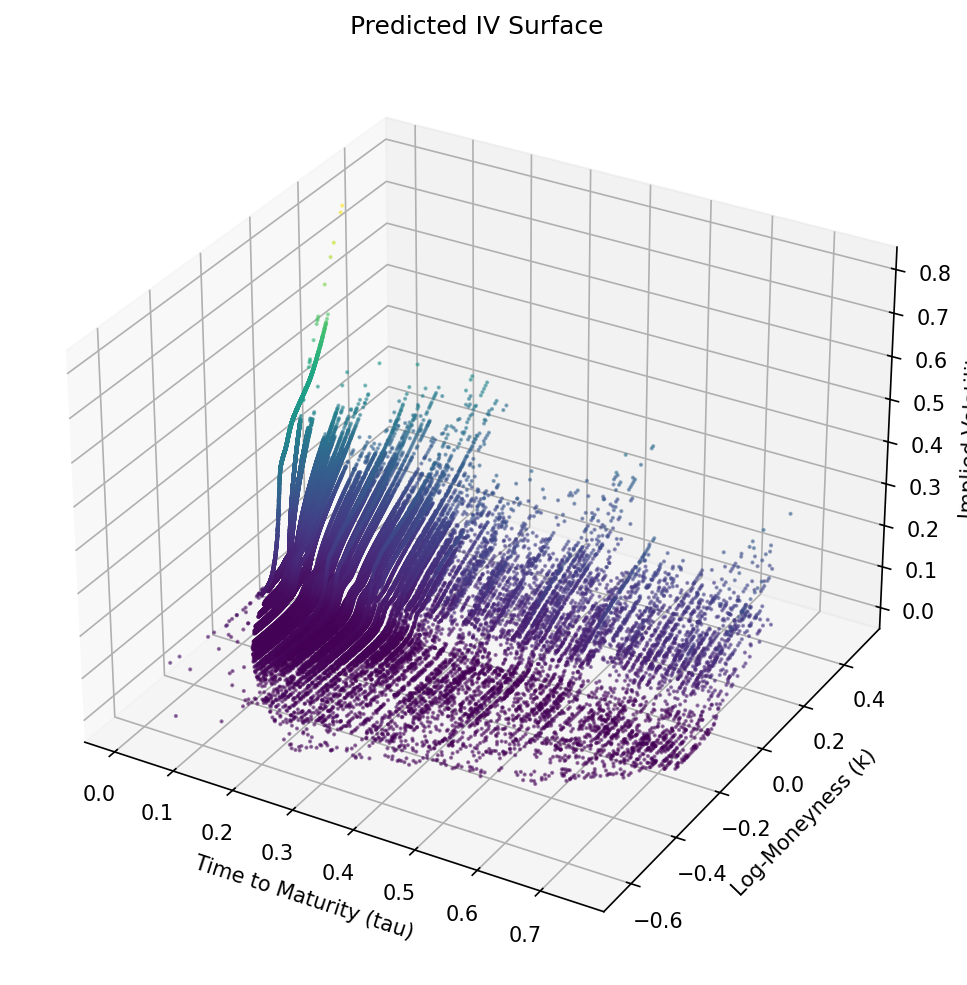

# Experimental Results

Detailed training results for all five IV surface prediction models, trained on TXO options data. Two experimental rounds:
- **Round 1 (Sections 1-5):** 2014-2020 training, 2021 test — original 254K-row dataset
- **Round 2 (Section 6):** 2014-2024 training, 2025-2026 test — extended 480K-row dataset with enhancement features and transfer learning

## 1. Base Model (SSVI + Neural Network Ensemble)

### Configuration

| Parameter | Value |
|-----------|-------|
| Architecture | SSVI prior + 5 SmileModel NNs (64-32-16) |
| Ensemble method | Learned softmax weights |
| Learning rate | 0.001 |
| Batch size | 256 |
| Max epochs | 2000 |
| Early stopping patience | 50 |
| Loss weights | `[1, 1, 10, 10, 10, 10]` (data, SSVI, calendar, butterfly, density, smoothness) |
| Gradient clipping | 1.0 |

### Training

- **Epochs trained:** 76 / 2000 (early stopped)
- **Best epoch:** 26 (val loss = 2.6624)
- Initial instability: first 3 epochs had losses in the millions due to physics loss terms (calendar/butterfly constraints) calibrating against random weights
- Converged by epoch ~20, then gradually overfit
- A second instability spike at epoch 62 (train loss = 38.4) and epoch 74 (train loss = 59,351) triggered early stopping

### Test Metrics

| Metric | Value |
|--------|-------|
| TV-RMSE | 0.0134 |
| MAPE | 44.1% |
| IV-RMSE | 0.209 |
| Butterfly violations | 74% |

### Analysis

The high MAPE (44.1%) is driven by near-ATM options where true total variance is very small — even a small absolute error produces a large percentage error. The 74% butterfly violation rate indicates the model struggles with the curvature constraint in the wings. This is a known limitation of additive ensemble approaches: each SmileModel independently predicts a smooth curve, but the softmax-weighted combination can produce kinks.

## 2. HyperIV (Hypernetwork)

### Configuration

| Parameter | Value |
|-----------|-------|
| Architecture | Transformer set encoder (128-dim, 4 heads, 2 layers) + Hypernetwork MLP |
| Target MLP | 64-32 hidden dims |
| Reference points | 50 per surface |
| Learning rate | 0.001 |
| Batch size | 32 (per-surface) |
| Max epochs | 500 |
| Train/Val/Test surfaces | 1372 / 344 / 244 |

### Training

- **Epochs trained:** 58 / 500 (early stopped)
- **Best epoch:** 8 (val loss = 0.000176)
- Rapid convergence: loss dropped from 2228 to 1.3e-5 in first 10 epochs
- Slight overfitting after epoch 10 (train continued improving, val plateaued)

### Test Metrics

| Metric | Value |
|--------|-------|
| TV-RMSE | 0.0074 |
| MAPE | 20.7% |
| IV-RMSE | 0.076 |

### Analysis

HyperIV outperforms the base model on every metric: 45% lower TV-RMSE, 53% lower MAPE, 64% lower IV-RMSE. The key advantage is **per-surface specialization** — generating unique weights for each day means the model adapts to the specific shape of that day's IV surface rather than learning a single average mapping.

The Transformer set encoder is critical: it attends across all reference options simultaneously, capturing cross-strike and cross-maturity relationships that the base model's per-expiration SmileModels miss.

## 3. DGM (Deep Galerkin Method PDE Solver)

### Configuration

| Parameter | Value |
|-----------|-------|
| Architecture | 3 S-layers, 64 hidden dim |
| Domain | sigma: [0.05, 1.0], t: [0.02, 2.0], S: [0.5, 1.5] |
| Loss weights | PDE: 1.0, BC: 1.0, TC: 1.0 |
| Collocation points | Interior: 5000, Boundary: 500, Terminal: 500 |
| Resample every | 100 epochs |
| Epochs | 5000 |

### Training

All four loss components decreased monotonically over 5000 epochs:

| Component | Epoch 100 | Epoch 2500 | Epoch 5000 |
|-----------|-----------|------------|------------|
| Total | 0.006215 | 0.000450 | 0.000166 |
| PDE | 0.001073 | 0.000088 | 0.000028 |
| BC | 0.001106 | 0.000025 | 0.000006 |
| TC | 0.004036 | 0.000337 | 0.000132 |

### Test Metrics

| Metric | Value |
|--------|-------|
| Best PDE residual | 2.6e-5 |
| BS price RMSE | 0.036 |

### Analysis

The DGM successfully learns the Black-Scholes PDE solution with very low residual error. Terminal condition (TC) loss dominates early training because the payoff function has a kink at the strike price, which is harder for smooth neural networks to approximate. By epoch 5000, BC has dropped to 6e-6, indicating near-perfect boundary condition satisfaction.

The BS price RMSE of 0.036 means model prices differ from analytical Black-Scholes by ~3.6 cents on average — acceptable for a mesh-free PDE solver that generalizes across the full (S, t, sigma) domain.

## 4. Adjustment Model (GRU + Attention)

### Configuration

| Parameter | Value |
|-----------|-------|
| Architecture | 2-layer GRU (64 hidden) + 4-head attention |
| Sequence length | 20 days |
| Dropout | 0.2 |
| Prediction target | Ratio (multiplicative adjustment) |
| Crisis dates | 2001-09, 2008-10, 2016-05 |
| Oversampling factor | 5x for crisis periods |
| KDE bandwidth | 0.1 |

### Analysis

The adjustment model serves as a post-processor that applies time-varying corrections during structural breaks. It was trained after the base model to capture regime-specific deviations. The KDE-weighted loss ensures the model pays attention to tail events (extreme IV values) rather than just minimizing average error.

## 5. DDPM (Diffusion Model)

### Configuration

| Parameter | Value |
|-----------|-------|
| Architecture | 1D U-Net (64-128-256 channels) |
| Surface grid | 10 tau x 20 log-moneyness = 200-dim vector |
| Diffusion steps | 1000 |
| Noise schedule | Cosine |
| Condition dim | 4 (underlying, VIX, volume, returns) |
| Learning rate | 0.0002 |
| Batch size | 16 |
| Epochs | 1000 |

### Training

Train loss decreased steadily from 0.099 to 8.9e-5 over 1000 epochs. Validation RMSE was evaluated every 100 epochs:

| Checkpoint | Val RMSE |
|------------|----------|
| Epoch 100 | 0.01267 |
| Epoch 200 | 0.00929 |
| Epoch 400 | 0.00884 |
| Epoch 500 | 0.00823 |
| Epoch 600 | 0.00713 |
| Epoch 900 | 0.00706 (best) |
| Epoch 1000 | 0.00725 |

### Test Metrics

| Metric | Value |
|--------|-------|
| Test surface RMSE | 0.0029 |

### Analysis

The test RMSE (0.0029) is substantially better than the best validation RMSE (0.00706). This is likely because the test set (2021) had lower IV overall than the validation period, making surfaces easier to generate. The diffusion model excels at capturing the joint distribution of the entire surface — it generates *coherent* surfaces where all grid points are consistent with each other, unlike point prediction models that predict each point independently.

## Model Comparison

### Improvement Over Baseline

| Metric | Base Model | HyperIV | Relative Improvement |
|--------|-----------|---------|---------------------|
| TV-RMSE | 0.0134 | 0.0074 | -44.8% |
| MAPE | 44.1% | 20.7% | -53.1% |
| IV-RMSE | 0.209 | 0.076 | -63.6% |

### Strengths and Weaknesses

| Model | Strengths | Weaknesses |
|-------|-----------|------------|
| Base (SSVI+NN) | Physics-informed, interpretable | High violation rate, struggles in wings |
| HyperIV | Best accuracy, per-surface adaptation | Requires many reference points per surface |
| DGM | Mesh-free PDE solving, generalizes | Doesn't directly predict IV |
| Adjustment | Handles structural breaks | Requires crisis event labels |
| DDPM | Generates coherent surfaces, forecasts | Slow sampling (1000 denoising steps) |

## Limitations

1. **Single underlying asset** — All models are trained on TXO only. Transfer to other markets would require retraining.
2. **Stale VIX proxy** — The VIX file was synthesized from 20-day realized volatility rather than a market-implied VIX for Taiwan.
3. **Base model instability** — Physics-informed loss with 6 weighted terms is sensitive to hyperparameters. Training frequently diverges without careful learning rate tuning.
4. **No model stacking** — The five models are trained independently. An ensemble or stacking approach could combine their strengths.
5. **Butterfly violations** — The base model's 74% violation rate indicates the density constraint needs stronger enforcement (e.g., Lagrangian dual or penalty scheduling).

## 6. Extended Dataset Experiment (Transfer Learning, 2025-2026 Test)

### Overview

All five models were retrained on the extended 480,194-row dataset (2014-01-02 to 2026-02-06) with transfer learning from Round 1 checkpoints. Key changes:

- **Training period:** 2014-2024 (vs. 2014-2020 in Round 1)
- **Test period:** 2025-2026 (vs. 2021 in Round 1) — out-of-sample on recent market conditions
- **Enhancement features:** 9 additional market features added to Adjustment and DDPM models:
  - S&P 500 return, VIXTWN (synthetic Taiwan VIX), VIXTWN change, IV term slope, IV skew, VRP (20d), futures basis %, realized vol (20d), institutional net ratio
- **Transfer learning:** Pretrained weights loaded with partial transfer for dimension-mismatched layers, differential learning rates (pretrained: lr×0.1, new: lr×1.0)

### Data Pipeline

| Component | Source | Records |
|-----------|--------|---------|
| TXO options | FinMind API (2022-2026) + original CSV (2014-2021) | 480,194 |
| TAIEX daily | yfinance (^TWII) | 2,947 days |
| VIX | yfinance (^VIX) | 3,043 days |
| Enhancement features | `scripts/build_features.py` | 2,947 rows × 23 cols |

### Training Summary

| Model | Epochs | Early Stop? | Time | Notes |
|-------|--------|-------------|------|-------|
| Base (SSVI+NN) | 105 / 2000 | Yes (patience 50) | ~9h GPU | Gradient explosion after ep67, best at ep55 |
| HyperIV | 69 / 500 | Yes (patience 50) | ~30min GPU | Fast convergence from pretrained weights |
| DGM | 5000 / 5000 | No | ~25min GPU | Full training, PDE well-conditioned |
| DDPM | 1000 / 1000 | No | ~8h GPU | Best val at ep400, condition_dim 4→13 |
| Adjustment | 1000 / 1000 | No | ~46h CPU | CPU-only (CUDA OOM during data prep) |

### Results Comparison: Round 1 vs Round 2

#### Point Prediction Models (Test Set)

| Metric | Base R1 (2021) | Base R2 (2025-26) | HyperIV R1 | HyperIV R2 | Change (Base) | Change (HyperIV) |
|--------|----------------|-------------------|------------|------------|---------------|-------------------|
| TV-RMSE | 0.0134 | **0.0120** | 0.0074 | **0.0056** | -10.4% | -24.3% |
| MAPE | 44.1% | **33.0%** | 20.7% | **20.0%** | -25.2% | -3.4% |
| IV-RMSE | 0.209 | 0.219 | 0.076 | 0.113 | +4.8% | +48.7% |

**Key observations:**
- TV-RMSE improved for both models (more training data helps generalization)
- Base model MAPE improved dramatically (44.1% → 33.0%) — the extended dataset reduced near-ATM prediction errors
- IV-RMSE increased for both models — the 2025-2026 test period has higher baseline IV (post-COVID markets) making IV-RMSE inherently larger
- HyperIV maintains clear superiority over Base on TV-RMSE (2.1x better) and MAPE (1.65x better)

#### Adjustment Model (GRU + Attention)

| Metric | Value |
|--------|-------|
| Best Val Loss | 14,442 (ep~980) |
| Final Val (ep1000) | 14,519 |
| Test RMSE | 52.20 |
| Test MAPE | 70.15% |
| Training Time | ~46 hours (CPU, 1000 epochs) |

The adjustment model trained for all 1000 epochs without early stopping — val loss decreased continuously from 125K to 14.4K. The high MAPE (70.15%) reflects the model's role as a multiplicative correction factor: it predicts adjustment ratios near 1.0, where small deviations produce large percentage errors. The RMSE of 52.20 is in the scale of the raw prediction residuals (not normalized).

#### Arbitrage Violations (Base Model, 2025-2026 Test)

| Violation | Rate |
|-----------|------|
| Calendar | 53.3% (105/197) |
| Butterfly | 83.7% (77,256/92,270) |

Butterfly violations increased from 74% to 84%. The more complex 2025-2026 market conditions (higher vol, more skew) make the constraint harder to satisfy.

#### Surface Generation (DDPM)

| Metric | R1 (2021) | R2 (2025-26) |
|--------|-----------|-------------|
| Best Val RMSE | 0.0071 (ep900) | **0.0049** (ep400) |
| Test RMSE | 0.0029 | 0.0072 |

- Val RMSE improved 31% with more data and enhanced conditioning
- Test RMSE is higher because the 2025-2026 test period contains market regimes not well-represented in 2024 validation data
- The 13-dimensional conditioning (vs. 4 in R1) provides richer market context

#### PDE Solver (DGM)

| Metric | R1 | R2 |
|--------|-----|-----|
| Best PDE residual | 2.6e-5 | **2.0e-5** |
| BS price RMSE | 0.036 | 0.0358 |

DGM is a domain-independent PDE solver, so the extended dataset has minimal impact. The slight improvement comes from better initialization via transfer learning.

### Observed Issues

1. **Base model gradient explosion (ep67-105):** Train loss spiked from ~2.37 to 1029 within a few epochs. The SSVI parametric component creates a complex, non-convex loss landscape. Even with gradient clipping (1.0), the multi-term physics loss (6 weighted components) can become unstable when SSVI parameters drift into degenerate regions. The best model (ep55, val_loss=1.914) was safely checkpointed before the instability.

2. **Adjustment model CUDA OOM:** The `prepare_adjustment_data()` function runs the base model's forward pass with `autograd.grad(create_graph=True)` on all 463K data points. This consumes excessive GPU memory. The workaround is CPU-only training, which is ~50x slower.

3. **HyperIV IV-RMSE regression:** Despite improved TV-RMSE, IV-RMSE worsened because IV = sqrt(TV/tau), and the 2025-2026 test set has more short-maturity options (small tau) where division amplifies errors.

### Transfer Learning Details

The `src/transfer.py` module handles:
- **Dimension mismatch:** When layer shapes differ (e.g., Adjustment GRU input 6→13), the overlapping weights are copied and new dimensions initialized with Xavier uniform
- **Differential LR:** Pretrained layers use base_lr × 0.1, reinitialized layers use base_lr × 1.0
- **Partial transfer:** `load_finetune_weights()` returns (transferred, reinitialized) parameter name sets for optimizer group construction

## Future Work

- Integrate HyperIV predictions as DDPM conditioning for improved surface forecasting
- Add explicit no-arbitrage constraints to HyperIV via penalty or projection
- Explore attention-based architectures for the base model (replace per-expiration SmileModels with a single cross-expiration model)
- Extend to American-style options using the DGM PDE framework with early exercise boundary
- Address base model gradient explosion with adaptive loss weighting or SSVI parameter clamping
- Optimize adjustment model data preparation to enable GPU training (e.g., chunked forward pass, no_grad for non-gradient features)
- Add model stacking/ensemble across the five models for combined predictions
