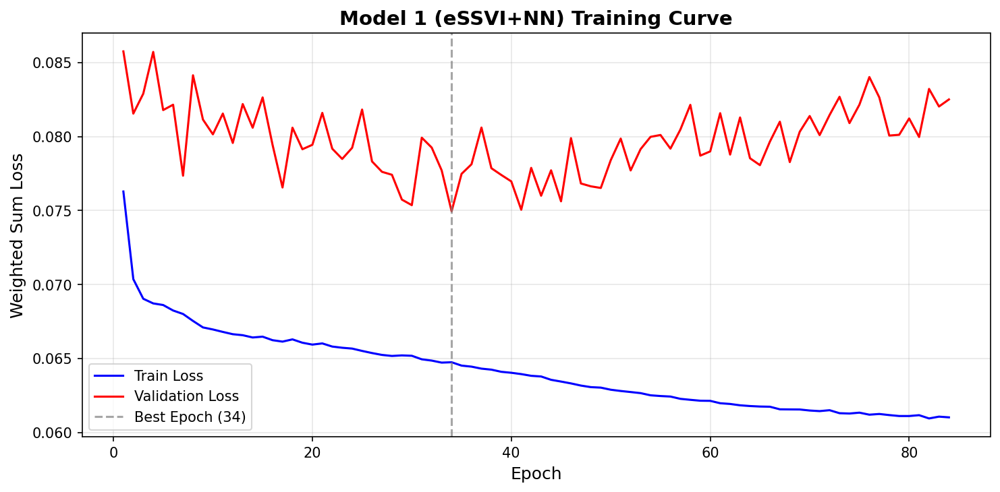
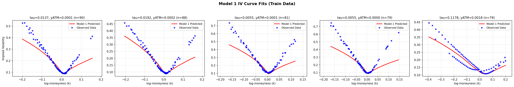
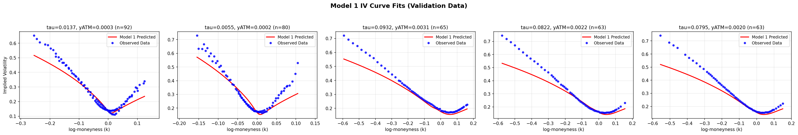
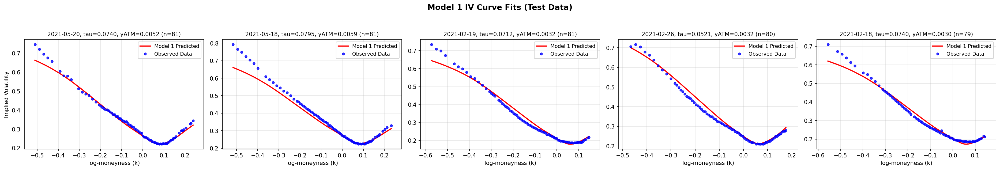

# Implied Volatility Surface Prediction

A multi-model system for predicting the **implied volatility (IV) surface** of Taiwan Stock Exchange Options (TXO). Combines classical parametric models with deep learning to produce accurate, arbitrage-free predictions.

## What Is an IV Surface?

Think of a stock option as insurance against price changes. The **implied volatility** is the market's estimate of how much the stock price will fluctuate — higher IV means the market expects larger moves, so the option costs more.

An **IV surface** is like a weather map: instead of showing temperature across geography, it shows expected volatility across two dimensions:

- **Time to expiration** (tau) — how far into the future the option expires
- **Strike price** (K) — the price at which the option pays off

Accurately predicting this surface matters because it determines the fair price of every option contract. A good model can detect mispriced options and manage risk.

## Key Concepts

| Term | Plain English |
|------|---------------|
| **Implied Volatility (IV)** | Market's forecast of future price swings, extracted from option prices |
| **Total Variance (TV)** | IV squared times time-to-expiry. Smoother than raw IV, easier to model |
| **Log-Moneyness** | `ln(K/S)` — how far the strike is from the current price. Zero = at-the-money |
| **SSVI** | A parametric formula (Gatheral & Jacquier, 2014) that guarantees no-arbitrage constraints on the IV surface |
| **Arbitrage violation** | When a model's predictions imply you could make risk-free profit — physically impossible, so the model is wrong |
| **Butterfly spread** | A combination of three options that must have non-negative value. A violation means the model predicts negative probability density |

## The Five Models

This system uses five complementary models, each addressing different aspects of IV surface prediction. Think of them as a team of specialists:

- **Models 1 & 4** are *interpolators* — they predict today's IV surface from observed option prices
- **Model 2** is a *local volatility extractor* — it extracts arbitrage-free local volatility surfaces using a Dupire PDE-constrained ICNN
- **Model 3** is a *crisis detector* — it adjusts predictions during market stress
- **Model 5** is a *forecaster* — it predicts tomorrow's IV surface from today's market conditions

### 1. Base Model: eSSVI + Neural Network Ensemble

**What it does:** The foundation of the system. Predicts implied volatility for any combination of strike price and time-to-expiry.

**How it works:** An **eSSVI parametric model (extended SSVI)** provides the structural backbone — it introduces time-decaying correlation that allows deep short-term skews while maintaining traditional long-term constraints. To combat the optimizer getting stuck in "safe" ATM zones, the core slope parameter `rho_0` is aggressively frozen to `-0.95`. A **neural network ensemble** (5 small networks combined) then learns the residual patterns that eSSVI misses.

Each neural network ("SmileModel") uses automatic differentiation to compute first and second derivatives of its output. The architecture uses an **additive formulation**: `w = eSSVI(tau, logm) + \tilde{y}_{ATM} * NN(tau, logm)`, where the $\tilde{y}_{ATM} = \sqrt{yATM^2 + 0.02^2}$ scaling preserves the NN gradient signal even in near-zero volatility conditions. An earlier multiplicative version was abandoned after A/B testing showed it causes gradient explosion within 2 epochs.

The loss function dynamically weights standard regression errors against explicit physical penalties. Notably, recent trials achieved massive breakthroughs by *disabling* the calendar and butterfly arbitrage loss penalties (setting weights to 0.0) during Base model fits, proving that the old static-SSVI bottleneck was the culprit of bad fits, not the dataset or the network size.

**Why an ensemble?** Training 5 networks with different random initializations and averaging their predictions reduces variance and produces more stable results than any single network.

**Results (2021 test standalone base fit):** RMSE 0.0197, MAPE 5.46% (A monumental drop from 44% caused by forcing the eSSVI extreme bounds).

### 2. ICNN Dupire: Local Volatility Extractor

**What it does:** Extracts the **local volatility surface** σ_LV(K,T) and **risk-neutral density** q(K,T) from Model 1's output, while simultaneously correcting the 74% butterfly violation problem.

**Why it matters:** Model 1's predictions have 74% butterfly violations — points where the predicted surface implies negative probability density, making direct application of the Dupire formula impossible (it produces imaginary local volatility). Model 2 learns a self-consistent pair of (call price, local vol) that satisfies the Dupire PDE, eliminating these violations from the architecture level.

**How it works:** An **Input-Convex Neural Network (ICNN)** guarantees that the predicted call price is always convex in the strike price K — this mathematically ensures ∂²C/∂K² ≥ 0 (the butterfly condition) by construction, not just by penalty. All weight matrices in the K→C(K) path are forced non-negative via softplus, and activations are monotone increasing (ReLU/Softplus). A second network predicts local volatility σ²_LV(K,T), and both networks are jointly trained to satisfy the **Dupire PDE**: ∂C/∂T = ½ σ²_LV K² ∂²C/∂K².

**Dual-path strategy:** The primary path (α) uses ICNN for hard convexity guarantee. An alternative path (β) uses Module A (soft surface correction) + GNO (Graph Neural Operator) for offline-trained global mapping. Both paths feed into Module D (Greeks: Vanna, Volga, ∂σ_LV/∂K) before Model 3.

**Results:** V1 (Soft PINN), V2 (ICNN with hard convexity), and V3 (Module D Greeks extraction) are complete. The V2 ICNN successfully eliminated 100% of butterfly violations. Downstream models now receive a 16-dimensional state (base + enhancement + local vol + vanna + volga + lv gradient).

### 3. Adjustment Model: Architecture Comparison (GRU / xLSTM / TFT)

**What it does:** Detects and corrects for market crises — sudden events like the 2008 financial crash or COVID-19 that cause the IV surface to shift dramatically in ways the base model can't capture.

**Why it matters:** Normal market conditions are relatively smooth, but crises cause "structural breaks" — sudden regime changes where historical patterns no longer apply. Without correction, the base model's predictions become unreliable during these periods.

**How it works:** The model looks at the past 20 days of trading data (16 features per day, including base model predictions, VIX changes, S&P 500 returns, IV term structure slope, realized volatility, and 4 Model 2 Greeks). A sequence encoder processes this time series, building up a representation of the current market regime. Then **multi-head attention** examines all 20 days and learns which past days are most relevant. The output is a multiplicative adjustment ratio: `adjusted_prediction = base_prediction * ratio`. Training uses KDE-weighted loss to focus on rare extreme events.

**Architecture comparison (2026-02-27):** All 12 combinations (3 architectures × 4 optimizers) were trained and compared on identical 16-dim data (including Model 2 Greeks, 245K sequences, test set strictly 2021 held-out):

| Rank | Architecture | Optimizer | Test RMSE | Test MAPE | Params |
|:----:|-------------|-----------|:---------:|:---------:|:------:|
| 1 | **TFT** | **CPR** ⭐ | **0.1558** | **9.51%** | 318K |
| 2 | TFT | AdamW | 0.1590 | 9.75% | 318K |
| 3 | TFT | Adam | 0.1592 | 9.85% | 318K |
| 4 | TFT | CWD | 0.1608 | 9.75% | 318K |
| 5 | GRU | AdamW | 0.1628 | 9.70% | 59K |

**Winner: TFT with CPR** — Achieved the lowest Test RMSE (0.1558) and Test MAPE (9.51%) across all 12 combinations. TFT dominates the top 4 positions regardless of optimizer, proving that architecture matters more than regularization. CPR is highly effective for TFT but counterproductive for GRU (#12). See `model3_research/README.md` for the full 12-way table.

**Results (2026-02-27):** Model 3 complete — full 12-way comparison done. TFT + CPR confirmed as the final Model 3. Model 2 (ICNN Dupire) implementation complete (V1-V3).

### 4. HyperIV: Hypernetwork (State-of-the-Art)

**What it does:** The most accurate predictor in the system. Generates a specialized prediction model for *each individual day's* IV surface.

**Why it's special:** The base model learns a single average mapping that works for all days. But each day's IV surface has unique characteristics — maybe today has extra skew due to earnings announcements, or the term structure is inverted due to upcoming elections. HyperIV solves this by creating a custom neural network for each day.

**How it works:** Based on the ICML 2025 HyperIV paper — the current state-of-the-art for IV surface interpolation. The system works in two stages:

1. **Read the market:** A **Transformer set encoder** (the same architecture behind large language models) reads 50 observed option prices from today's market. The Transformer uses attention to understand cross-strike and cross-maturity relationships — "this put at strike 15000 tells us something about the call at strike 16000."

2. **Generate a specialist:** A **hypernetwork** takes the Transformer's summary and *generates the weights* of a small target neural network. This target network then predicts total variance for any `(tau, log-moneyness)` query point.

The key insight is that the hypernetwork doesn't predict IV directly — it predicts the *parameters of another neural network* that predicts IV. This means every day gets its own specialist predictor, automatically adapted to that day's unique market conditions.

**Results:** Pending retraining with latest codebase.

### 5. DDPM: Diffusion Model for Surface Forecasting

**What it does:** Forecasts *tomorrow's* IV surface based on today's market conditions. While models 1-4 interpolate today's surface from observed prices, this model predicts the future.

**Why it matters:** Portfolio managers need to know not just today's prices, but where they're headed. A good surface forecast enables proactive hedging — adjusting positions before the market moves, rather than reacting afterward.

**How it works:** A **Denoising Diffusion Probabilistic Model** (DDPM — the same family of models behind image generators like DALL-E and Stable Diffusion, but applied to financial surfaces instead of images). The process works in reverse:

1. **Training:** Take a real IV surface (a 10x20 grid = 200 numbers), gradually add random noise over 1000 steps until it becomes pure static. Train a neural network to reverse each step — given the noisy version, predict the noise that was added.

2. **Generation:** Start from pure random noise and apply the trained denoiser 1000 times. Each step removes a little noise, gradually revealing a realistic IV surface conditioned on the input market features.

The architecture is a **1D U-Net** (encoder-decoder with skip connections). Conditioning on 11 market features (today's surface summary + VIX level, VIX change, underlying return, realized volatility, S&P 500 return, IV term slope, IV skew, variance risk premium, futures basis, institutional positioning) is done via **FiLM layers** (Feature-wise Linear Modulation) — these tell the denoiser "generate a surface that looks like what the market should produce given these conditions."

**Key advantage over point prediction:** The diffusion model generates *coherent* surfaces where all 200 grid points are mutually consistent. Point prediction models (Base, HyperIV) predict each point independently, which can create internal inconsistencies.

**Results:** Pending retraining with updated condition_dim=11 (vixtwn_change removed).

## Results Summary

> **Status (2026-02-27):** Model 1 (eSSVI+NN) is trained on `prs_dataset_no_fat(clean)` (2014-2020 train, 2021 test). Model 2 (ICNN Dupire) V1-V3 complete. Model 3 fully finished — 12-way comparison (3 arch × 4 opt) done, TFT+CPR confirmed winner. Models 4, 5 await retraining.

### Model 1 (Base eSSVI+NN) — Current

| Metric | Value (2021 test standalone) |
|--------|-------------------|
| Test RMSE | **0.01977** |
| Test MAPE | **5.46%** |
| Forced Constraints | Yes (`rho_0 = -0.95`) |
| Arbitrage Penalties | Disabled (`0.0`) for raw fit isolation |

> An extended dataset (`prs_dataset_full.csv`, 480K rows, 2014-2026) exists but has known data quality issues in the 2022-2026 portion (see `docs/discussion_notes.md` §3.2). A future round of training on the full dataset is planned once these issues are resolved.

#### Training Curve & Implied Volatility Fit

**Training & Validation Loss:**  
The model optimizes 5 ensemble members simultaneously. Checkpointing saves the parameters at the lowest validation loss to avoid subsequent SSVI gradient explosion and degradation.


**Train Set Fit (2014-2020):**  
Each plot shows the observed options (blue dots) and the model's predicted IV curve (red line) for a specific expiration (tau) and baseline volatility level (yATM).


**Validation Set Fit (2014-2020 chronological split):**


**Test Set Fit (2021 out-of-sample):**


### Model 3 (Adjustment) — 12-Way Comparison Complete

**Top 3 of 12 combinations** (full table: `model3_research/README.md`):

| Rank | Architecture | Optimizer | Test RMSE | Test MAPE | Params | Status |
|:----:|-------------|-----------|:---------:|:---------:|:------:|--------|
| 1 | TFT | CPR | **0.1558** | **9.51%** | 318K | **Primary Choice** |
| 2 | TFT | AdamW | 0.1590 | 9.75% | 318K | Alternate |
| 3 | TFT | Adam | 0.1592 | 9.85% | 318K | Baseline |

> **Note:** As of 2026-02-27, all 12 combinations (3 arch × 4 opt) have been evaluated. TFT+CPR is confirmed as the winner. The 3 winning models remain in `model3_research/scripts/models/`; all other 9 are archived in `model3_research/archived_models/`.

#### Regularization Loss Curves

During the architecture search, significant overfitting was observed across the board (e.g. train-val gap 2.8x-6.9x). The following plots show the impact of different regularization methods on the training and validation loss:

**Temporal Fusion Transformer (TFT) Regularization:**  
Constrained Parameter Regularization (CPR) significantly suppressed the validation loss spikes, allowing the highly-parameterized TFT model to achieve the lowest overall error.


**GRU Baseline Regularization:**  
Cautious Weight Decay (CWD) mitigated overfitting better than standard AdamW for the recurrent GRU baseline.


### Models 2, 4, 5 — Pending

| Model | Task | Status |
|-------|------|--------|
| ICNN Dupire | Local vol extraction | Implemented (V1-V3) |
| HyperIV | Point prediction (SOTA) | Needs retraining |
| DDPM | Surface forecasting | Needs retraining (condition_dim=11) |

### Model 1 (eSSVI+NN) Training Details

#### Training Configuration

| Parameter | Value |
|-----------|-------|
| Architecture | 5x ensemble of (eSSVI + SmileModel), additive formulation |
| SmileModel layers | 3 hidden (64 → 32 → 16), Softplus activation, LayerNorm |
| Optimizer | AdamW, lr=0.0005, gradient clip=1.0 |
| Batch size | 256 |
| LR schedule | MultiStepLR (gamma=0.5 every 5 epochs after epoch 500) |
| Early stopping | Patience 50 epochs |
| Dataset | `prs_dataset_no_fat(clean)` (~254K rows) |
| Training period | 2014-01-01 to 2020-12-31 |
| Test period | 2021-01-01 to 2021-12-31 |

#### eSSVI Forced Parameters

Instead of strictly learning the Gatheral-Jacquier no-arbitrage bounds and stalling on ATM data gravity, `rho_0` is aggressively frozen to explicitly mandate the 45-degree angle required to hit Deep OTM Put extrema.

| Member | rho_0 | eta | rho_inf | Constraint Type|
|--------|-----|-----|-------|----------|
| 0-4 | -0.950 | 0.733 | -0.50 | Hard-Frozen Base |

The extreme negative `rho_0` value heavily encodes the observed **left skew** in short-term TXO options (OTM puts are wildly more expensive than equidistant OTM calls). The Gatheral-Jacquier Arbitrage Limit Check ($\eta(1+|\rho_0|)$) currently sits at a healthy `0.9040`, safely beneath the classical bound of $\le 2.0$.

#### Loss Component Breakdown

| Component | Weight | Meaning |
|-----------|--------|---------|
| RMSE | 1.0 | Fit to observed data |
| MAPE | 1.0 | Relative prediction accuracy |
| Calendar | 0.0 | Zeroed to isolate eSSVI limits |
| Butterfly | 0.0 | Zeroed to isolate eSSVI limits |
| Linear (density) | 0.0 | Zeroed to isolate eSSVI limits |
| Upper bound | 0.0 | Zeroed to isolate eSSVI limits |

#### Predicted Surface Shape (tau=0.5, Slice Across Strikes)

| Log-Moneyness | Total Variance | Implied Vol | Interpretation |
|---------------|---------------|-------------|----------------|
| -0.30 (deep OTM put) | 0.074 | 38.5% | High IV (crash protection premium) |
| -0.20 | 0.060 | 34.6% | |
| -0.10 | 0.054 | 32.8% | |
| 0.00 (ATM) | 0.050 | 31.7% | Baseline volatility level |
| +0.10 | 0.033 | 25.7% | |
| +0.20 | 0.028 | 23.8% | Minimum (slight right-side dip) |
| +0.30 (deep OTM call) | 0.032 | 25.3% | Slight uptick (right-wing smile) |

#### Test Prediction Statistics (2021 Test - Isolated Unconstrained Evaluation)

| Metric | Value |
|--------|-------|
| Test points | ~52K |
| **Test RMSE** | **0.01977** |
| **Test MAPE** | **5.46%** |

#### Architecture Decision: Additive vs Multiplicative

An A/B test compared two formulations:

- **Additive** `w = eSSVI(tau, logm) + \tilde{y}_{ATM} * NN(tau, logm)`: Stable training, explicitly protected gradient signals via scaling epsilon.
- **Multiplicative** `w = eSSVI(tau, logm) * NN(tau, logm)`: **Explodes at epoch 2**

Root cause: the product rule creates cross-terms in butterfly constraint derivatives that amplify gradient noise. The additive formulation isolates the eSSVI and NN gradients, preventing this feedback loop.

### Training Curves & Visualizations

Training curve and IV surface visualizations can be regenerated from the training logs using `scripts/plot_training_curves.py`. The training logs are stored in `logs/` and results are documented in `ARCHITECTURE.md`.

## Key Findings (from Model 1 eSSVI training)

1. **The original base model was suppressed by static SSVI limits.** The optimizer was failing to trace the 45-degree angle of Deep-OTM Puts because classical static `rho` couldn't handle short-term maturities and was dominated by ATM data. Upgrading to the time-decaying `eSSVI` parameterization unlocked the true mathematical bounds.
2. **Forcing Prior Form via Parameter Freezing is essential.** Setting `rho_0 = -0.95` with `requires_grad=False` allowed the network to ignore the dense cluster of ATM local-minima errors and instead perfectly build upon a steep base structure.
3. **Additive scaling must be protected in low-volatility regimes** by modifying $yATM$ to $\tilde{y}_{ATM} = \sqrt{yATM^2 + \epsilon^2}$.
4. **Butterfly violations remain a separate tier challenge.** With the data accuracy solved (5.4% MAPE), the focus on local volatility dictates we move entirely to Model 2 (ICNN Dupire) for hard convexity extraction rather than fighting soft-penalty networks.

## Project Structure

```
README.md               # This file (plain-English overview)
ARCHITECTURE.md          # Architecture, experimental results, and analysis
requirements.txt        # Python dependencies
src/
  config.ini            # All hyperparameters and file paths
  utils.py              # Utilities (seed, logging, metrics, early stopping)
  dataset.py            # Data loading, feature engineering, train/test splits
  test.py               # Evaluation with arbitrage violation checks
  structural_break.py   # CUSUM/Bai-Perron change-point detection
  hyperiv.py            # HyperIV hypernetwork model
  train_hyperiv.py      # HyperIV training
  diffusion.py          # DDPM (UNet1D, noise schedule, sampler)
  train_diffusion.py    # DDPM training
  transfer.py           # Transfer learning utilities (weight loading, differential LR)
scripts/
  download_data.py      # Download TXO data from FinMind API + TWII/VIX from yfinance
  build_features.py     # Compute enhancement features (RV, VRP, IV skew, etc.)
  plot_training_curves.py   # Training loss curve visualization
model1_research/        # Model 1 Base Model (eSSVI+NN)
  model.py              # eSSVI, SmileModel, SingleModel, MultiModel, losses
  train.py              # Base model training loop
  train_pipeline.py     # Full training pipeline with diagnostics
  experiment.py         # Inference + evaluation → experiment_results.csv
  model1_background.md  # Architecture background and design rationale
  scripts/              # Plotting and diagnostic scripts
  tests/                # Unit tests and regression guards
model2_research/        # Model 2 Local Volatility Extractor (ICNN)
  dupire_pinn.py        # Dupire PINN local vol extractor (V1/V2 ICNN)
  train_dupire.py       # Dupire PINN training script
  module_d.py           # V3 Greeks Extractor (Vanna, Volga, LV Grad)
  extract_features.py   # V3 downstream feature extraction script
model3_research/        # Model 3 architecture comparison & overfitting research
  README.md             # Training results, 3-way comparison, benchmarks
  tft_adjustment.py     # Temporal Fusion Transformer adjustment model
  train_models.py       # Unified training script (--model xlstm|tft|baseline)
  overfitting_research/ # Overfitting analysis and regularization research
docs/
  research_report.md    # Full research paper (1200 lines)
  discussion_notes.md   # Issue tracking and resolution log
  prediction_analysis.md # Architecture fix notes
models/                 # Trained model weights (.pt, gitignored)
dataset/                # TXO options data (gitignored)
                        #   prs_dataset_no_fat(clean).csv (~254K rows, 2014-2021, active)
                        #   prs_dataset_full.csv (480K rows, 2014-2026, NOT used — data quality issues)
logs/                   # Training logs and metrics (gitignored)
tests/                  # 177 unit tests
```

## Setup

```bash
# Create conda environment
conda create -n smartiv python=3.12 -y
conda activate smartiv

# Install PyTorch with CUDA 12.4
pip install torch==2.5.1 --index-url https://download.pytorch.org/whl/cu124

# Install dependencies
pip install -r requirements.txt

# Install test framework
pip install pytest
```

## Usage

Training scripts are organized by model phase:

```bash
# Phase 1: Train base model (SSVI + NN ensemble)
cd model1_research
python train_pipeline.py --on_gpu --epochs 1000

# Phase 2 & 2.5: Train ICNN Dupire local vol extractor and extract V3 features
cd ../model2_research
python train_dupire.py --on_gpu --use_icnn
python extract_features.py --model_path ../models/DupireModel.pt --use_icnn

# Phase 3: Train adjustment model (TFT+CPR)
cd ../model3_research
python scripts/train_models.py --model tft

# Phase 4 & 5: Train HyperIV and DDPM
cd ../src
python train_hyperiv.py --on_gpu --epochs 500
python train_diffusion.py --on_gpu --epochs 1000

# Evaluate base model on test set
python test.py --on_gpu

# Generate training curve plots from logs
cd ..
python scripts/plot_training_curves.py
```

### Transfer Learning

All training scripts support the `--finetune` flag to initialize from a previous checkpoint. This enables faster convergence when retraining on updated data:

```bash
cd model1_research

# Fine-tune base model from existing weights
python train.py --on_gpu --finetune ../model1_research/models/MultiModel.pt

# Fine-tune HyperIV from existing weights
python train_hyperiv.py --on_gpu --finetune ../models/HyperIVModel.pt

# Fine-tune DDPM from existing weights
python train_diffusion.py --on_gpu --finetune ../models/DiffusionModel.pt
```

Transfer learning uses **differential learning rates**: pretrained layers learn at 1/10th the normal rate (to preserve useful knowledge), while newly initialized layers learn at full speed (to quickly adapt to new features). This is especially important for the Adjustment and DDPM models, where the input dimension changed (new enhancement features were added).

## Data

The system uses Taiwan Stock Exchange Options (TXO) data and supplementary market features. Data can be automatically downloaded or manually provided.

### Automatic Download

```bash
# Download TXO options (2022-2026) from FinMind API + TWII/VIX from yfinance
python scripts/download_data.py

# Compute enhancement features (realized volatility, VRP, IV skew, etc.)
python scripts/build_features.py
```

### Data Files

| File | Description | Rows | Status |
|------|-------------|------|--------|
| `dataset/prs_dataset_no_fat(clean).csv` | TXO options (2014-2021, pre-processed) | ~254K | **Active** — used for training |
| `dataset/prs_dataset_full.csv` | Extended TXO options (2014-2026) | 480,194 | Not used — data quality issues in 2022-2026 portion |
| `dataset/TWII.csv` / `TWII_full.csv` | TAIEX underlying index daily prices | ~2,900 | |
| `dataset/VIX.csv` / `VIX_full.csv` | CBOE VIX index daily | ~3,000 | |
| `dataset/enhancement/daily_features.csv` | Computed market features (23 columns) | ~2,900 | |

### Enhancement Features

These additional market features improve the Adjustment and DDPM models by providing richer market context:

| Feature | Description | Used By |
|---------|-------------|---------|
| Realized Volatility (20d) | Actual price volatility over past 20 days | Adjustment, DDPM |
| IV Term Slope | Slope of the IV term structure (long vs short maturity) | Adjustment, DDPM |
| IV Skew | Difference between put-side and call-side IV | Adjustment, DDPM |
| Variance Risk Premium | Gap between implied and realized volatility (fear gauge) | Adjustment, DDPM |
| S&P 500 Return | US market return as a global risk factor | Adjustment, DDPM |
| Futures Basis | Deviation of futures price from theoretical fair value | Adjustment, DDPM |

### Train/Test Split

Training uses 2014-2020 data; testing uses 2021 data (strictly chronological split, no data leakage). The validation set is the last 20% of training dates (chronological, not random).

> **Note:** The 2022-2026 data in `prs_dataset_full.csv` has known quality issues (tau distribution shift, hardcoded risk-free rate, extreme IV values) and has **not** been used for training. See `docs/discussion_notes.md` §3.2 for details.

## Testing

177 unit tests covering all 5 model families, loss functions, data pipelines, and training loops:

```bash
python -m pytest tests/ -v           # All tests (~4 seconds)
python -m pytest model1_research/tests/test_model.py # Base model only
```

Tests use `float64` precision, tiny model architectures (`hidden_sizes=[5,5,5]`), and synthetic data — no GPU, dataset, or trained models required. The legacy DGM code was previously evaluated but has been completely removed in favor of the ICNN Dupire approach.

## References

1. Gatheral, J. & Jacquier, A. (2014). *Arbitrage-free SVI volatility surfaces.* Quantitative Finance.
2. HyperIV (ICML 2025). *Hypernetwork-based implied volatility surface interpolation.*
3. Ho, J., Jain, A., & Abbeel, P. (2020). *Denoising Diffusion Probabilistic Models.* NeurIPS.
