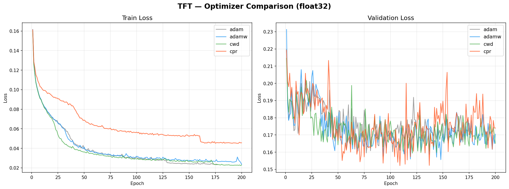
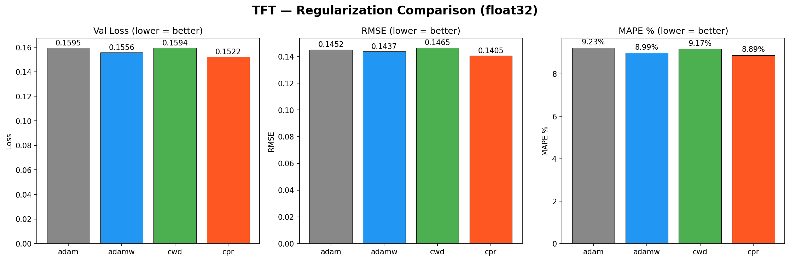

# Model 3 正則化實驗結果

> 基於 4 種 optimizer 的比較實驗（AdamW, CWD, CPR vs Adam baseline）

## GRU (baseline)

| Optimizer | Val Loss | RMSE | MAPE | Best Epoch | Time (min) |
|-----------|:--------:|:----:|:----:|:----------:|:----------:|
| cwd ⭐ | 0.158247 | 0.144784 | 9.13% | 70 | 45.1 |
| adamw | 0.159627 | 0.146145 | 9.22% | 69 | 42.2 |
| adam | 0.163861 | 0.147733 | 9.43% | 70 | 38.1 |
| cpr | 0.194493 (+18.7%) | 0.169777 | 10.61% | 20 | 36.6 |

## TFT

| Optimizer | Val Loss | RMSE | MAPE | Best Epoch | Time (min) |
|-----------|:--------:|:----:|:----:|:----------:|:----------:|
| cpr ⭐ | 0.152183 | 0.140493 | 8.89% | 108 | 175.3 |
| adamw | 0.155626 | 0.143668 | 8.99% | 147 | 129.3 |
| cwd | 0.159427 | 0.146463 | 9.17% | 120 | 175.9 |
| adam | 0.159517 | 0.145189 | 9.23% | 76 | 79.4 |

